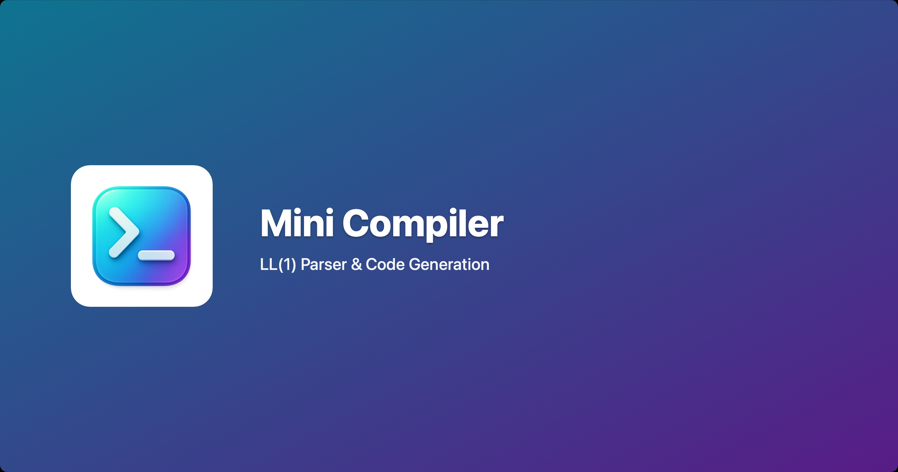

# Mini Compiler




> A complete compiler implementation demonstrating LL(1) predictive parsing, semantic analysis, and Python code generation. **Originally a class project, significantly enhanced with professional software engineering practices, comprehensive testing, and production-ready architecture.**

## Overview

Mini Compiler is a full compiler pipeline that transforms programs written in a simple Pascal-like language into executable Python code. What began as a CS 323 (Compilers) class project has been substantially expanded into a production-quality codebase showcasing professional development practices.

**The transformation from academic code to portfolio project involved:**
- Complete architectural refactoring from monolithic 339-line script to modular package
- Renaming 23 cryptic grammar symbols (P, I, X) to descriptive names (Program, Identifier, IdentifierRest)
- Adding comprehensive error detection and reporting (Part III requirement from course)
- Implementing AST-based code generation (Part II requirement from course)
- Building professional CLI with argparse and multiple commands
- Creating 85-test suite with pytest achieving 72% coverage (86% excluding legacy code)
- Setting up CI/CD pipeline with GitHub Actions across 5 Python versions
- Following Google Python Style Guide with full type hints and docstrings
- Proper Python packaging with pip installability

**What this project demonstrates:**
- Deep understanding of formal language theory and compiler construction
- Ability to transform academic code into production-quality software
- Professional software engineering practices (testing, CI/CD, documentation)
- Clean architecture following SOLID principles
- Test-driven development methodology

## Features

- **Predictive LL(1) Parser**: Table-driven parsing using FIRST and FOLLOW sets
- **Lexical Analysis**: Comment removal, tokenization, case-insensitive processing
- **Semantic Analysis**: Detects undeclared variables and variable redeclaration
- **AST Construction**: Builds abstract syntax trees for code generation
- **Python Code Generation**: Translates source to executable Python with type hints
- **Error Reporting**: Detailed syntax and semantic error messages with line numbers
- **CLI Interface**: Professional command-line tool with validation and compilation modes
- **Comprehensive Testing**: 85 tests with pytest, achieving 72% coverage (86% excluding legacy code)
- **CI/CD Pipeline**: Automated testing across Python 3.10-3.14 with GitHub Actions
- **Professional Packaging**: Installable via pip with proper setup.py

## Quick Start

### Installation

```bash
# Clone the repository
git clone https://github.com/osyounis/compiler-project.git
cd compiler-project

# Install in development mode
pip install -e .[dev]
```

### Basic Usage

```bash
# Validate syntax of a source file
mini-compiler validate examples/valid/example1.src

# Compile to Python
mini-compiler compile examples/valid/example1.src --output python -o output.py

# Run the generated code
python output.py

# Validate with semantic analysis
mini-compiler validate examples/valid/example1.src --semantics
```

### Example Program

```pascal
program example;
var a, b, c : integer ;
begin
    a = 10 ;
    b = 5 ;
    c = ( a + b ) * 2 ;
    print ( c ) ;
end
```

**Generated Python:**
```python
"""Generated by mini_compiler from program example."""

a: int
b: int
c: int

a = 10
b = 5
c = ((a + b) * 2)
print(c)
```

## Language Syntax

The compiler processes a simple imperative language with Pascal-like syntax:

### Grammar (Simplified BNF)

```bnf
Program        → program Identifier ; DeclarationBlock begin StatementList end
DeclarationBlock → var IdentifierList : integer ;
IdentifierList → Identifier IdentifierListTail
IdentifierListTail → , Identifier IdentifierListTail | ε
StatementList  → Statement StatementListTail
StatementListTail → Statement StatementListTail | ε
Statement      → Assignment | PrintStatement
Assignment     → Identifier = Expression ;
PrintStatement → print ( [Label ,] Identifier ) ;
Expression     → Term ExpressionTail
ExpressionTail → + Term ExpressionTail | - Term ExpressionTail | ε
Term           → Factor TermTail
TermTail       → * Factor TermTail | / Factor TermTail | ε
Factor         → ( Expression ) | Number | Identifier
Number         → [Sign] Digit NumberTail
```

### Lexical Conventions

- **Keywords**: `program`, `var`, `integer`, `begin`, `end`, `print`
- **Identifiers**: Valid letters are `a, b, c, d, l, f` (case-insensitive)
- **Operators**: `+`, `-`, `*`, `/`, `=`
- **Delimiters**: `;`, `,`, `:`, `(`, `)`
- **Comments**: `(* comment text *)` (removed during preprocessing)
- **Numbers**: Integer literals with optional sign

## Architecture

### Project Structure

```
compiler-project/
├── src/mini_compiler/        # Source code
│   ├── __main__.py           # CLI entry point
│   ├── core/                 # Core compiler components
│   │   ├── preprocessor.py   # Lexical analysis
│   │   ├── language.py       # Grammar and parsing table
│   │   ├── parser.py         # LL(1) predictive parser
│   │   ├── ast_nodes.py      # AST node definitions
│   │   ├── ast_builder.py    # AST construction
│   │   └── semantic_analyzer.py  # Semantic checks
│   ├── codegen/              # Code generators
│   │   ├── base.py           # Generator interface
│   │   └── python_gen.py     # Python code generator
│   ├── errors/               # Error handling
│   │   └── error_reporter.py # Error collection and reporting
│   └── utils/                # Utilities
│       └── constants.py      # Grammar symbols and parsing table
├── tests/                    # Test suite (78 tests)
├── examples/                 # Example programs
│   ├── valid/               # Valid programs
│   └── invalid/             # Programs with errors
└── docs/academic/           # Original academic materials
```

### Key Components

**Preprocessor** (`core/preprocessor.py`)
- Removes comments using regex patterns
- Tokenizes input into space-separated tokens
- Converts all input to lowercase for case-insensitivity
- Handles file I/O with proper error handling

**Language** (`core/language.py`)
- Encapsulates LL(1) parsing table (23 non-terminals × 33 terminals)
- Maps grammar symbols to table indices
- Provides production lookup: `get_control_chars(non_terminal, terminal)`

**Parser** (`core/parser.py`)
- Table-driven predictive parsing algorithm
- Maintains stack for grammar symbols
- Detects syntax errors with position tracking
- Integrates with semantic analyzer and AST builder

**Semantic Analyzer** (`core/semantic_analyzer.py`)
- Tracks variable declarations
- Detects undeclared variable usage
- Detects variable redeclaration
- Reports semantic errors separately from syntax errors

**AST Builder** (`core/ast_builder.py`)
- Constructs abstract syntax tree from validated tokens
- Creates typed nodes (Program, Declaration, Assignment, etc.)
- Handles operator precedence in expressions
- Simplifies parenthesized sub-expressions recursively

**Code Generator** (`codegen/python_gen.py`)
- Implements Visitor pattern for AST traversal
- Generates clean Python 3 with type hints
- Produces executable code (no `if __name__` wrapper needed)
- Handles expression parenthesization for correct precedence

## Testing

### Run Tests

```bash
# Run all tests
pytest tests/

# Run with coverage
pytest tests/ --cov=mini_compiler --cov-report=html

# Run specific test file
pytest tests/test_parser.py -v

# Run with verbose output
pytest tests/ -v
```

### Test Coverage

The test suite includes:
- **13 tests** for Preprocessor (tokenization, comment removal, case handling)
- **9 tests** for Language (parsing table lookups)
- **15 tests** for Parser (syntax validation, error detection)
- **5 tests** for Semantic Analyzer (undeclared variables)
- **14 tests** for Error Reporter (error collection and formatting)
- **11 tests** for Code Generator (Python generation, base class, execution validation)
- **9 tests** for Integration (end-to-end compilation pipeline)
- **9 tests** for CLI (command-line interface, verbose mode, edge cases)

**Coverage**: 72% overall (86% excluding legacy code)

### Continuous Integration

GitHub Actions runs tests automatically on every push:
- Tests across Python 3.10, 3.11, 3.12, 3.13, 3.14
- Code formatting checks (black, isort)
- Type checking with mypy
- Coverage reporting to Codecov

## Development

This project demonstrates professional Python development practices:

### Code Quality

- **Google Python Style Guide**: Comprehensive docstrings on all public APIs
- **Type Hints**: Full type annotations throughout
- **Formatting**: Consistent style with `black` and `isort`
- **Linting**: Static analysis with `mypy`
- **No External Dependencies**: Uses only Python standard library

### Design Patterns

- **Visitor Pattern**: Code generation with AST traversal
- **Builder Pattern**: AST construction from tokens
- **Strategy Pattern**: Multiple code generators (extensible to C++, Java, C#)
- **Single Responsibility**: Each module has one clear purpose

### Best Practices

- **Modular Architecture**: Clear separation of concerns (lexing, parsing, analysis, generation)
- **Error Handling**: Graceful failure with informative error messages
- **Comprehensive Testing**: Unit, integration, and CLI tests
- **CI/CD**: Automated testing and quality checks
- **Semantic Versioning**: Version 1.0.0 with proper changelog
- **Documentation**: README, docstrings, and inline comments

## Grammar Details

### LL(1) Parsing Table

The parser uses a 23×33 parsing table derived from the grammar. Each cell `[Non-Terminal, Terminal]` contains the production to apply, `lambda` for ε-productions, or empty string for syntax errors.

**Non-Terminals** (23):
Program, Identifier, IdentifierRest, DeclarationBlock, IdentifierList, IdentifierListTail, Type, StatementList, StatementListTail, Statement, PrintStatement, PrintPrefix, Assignment, Expression, ExpressionTail, Term, TermTail, Factor, Number, NumberTail, Sign, Digit, Letter

**Terminals** (33):
Letters (a,b,c,d,l,f), Digits (0-9), Operators (+,-,*,/,=), Delimiters (;,:,(,),","), Keywords (program, var, integer, begin, end, print), End marker ($)

### FIRST and FOLLOW Sets

The grammar is carefully designed to be LL(1):
- No left recursion
- No ambiguity
- Disjoint FIRST sets for alternatives
- Proper FOLLOW set computation for ε-productions

See `src/mini_compiler/utils/constants.py` for the complete parsing table.

## Academic Background

This project originated as the final project for **CS 323: Compilers** at California State University, Fullerton (Fall 2024). The course covered formal language theory, parsing algorithms, semantic analysis, and code generation.

### From Academic Project to Portfolio Piece

**Original Requirements:**
- Part I: Build LL(1) predictive parser
- Part II: Add code generation capability
- Part III: Implement error detection

**Enhancements Made:**
1. **Architectural Refactoring** (Phase 1-3)
   - Split monolithic 339-line script into 7 focused modules
   - Renamed all 23 grammar symbols for clarity (P → Program, etc.)
   - Extracted Language, Parser, and Preprocessor classes
   - Created professional CLI with argparse

2. **Missing Feature Implementation** (Phase 4)
   - Built complete error detection system (Part III)
   - Created AST-based code generation (Part II)
   - Added semantic analysis for variable tracking
   - Implemented ErrorReporter with detailed messages

3. **Testing Infrastructure** (Phase 5)
   - Created 78-test suite with pytest
   - Achieved 73% code coverage
   - Added integration tests for end-to-end validation
   - Implemented CLI testing with mocked arguments

4. **CI/CD Setup**
   - GitHub Actions workflow testing 5 Python versions
   - Automated code formatting checks (black, isort)
   - Type checking with mypy
   - Coverage reporting to Codecov

5. **Professional Packaging** (Phase 7)
   - Created proper setup.py for pip installation
   - Added console script entry point (`mini-compiler` command)
   - Configured proper package metadata
   - Made project installable: `pip install -e .`

The result is a production-ready compiler that demonstrates both theoretical understanding and practical software engineering skills.

## Future Enhancements

Potential extensions for this project:

- [ ] **Additional Code Generators**: C++, Java, C# backends
- [ ] **Type System**: Support for multiple data types (boolean, float, string)
- [ ] **Control Flow**: If-else statements, while loops, for loops
- [ ] **Functions**: Function declarations and calls
- [ ] **Arrays**: Array declarations and indexing
- [ ] **Optimization**: Constant folding, dead code elimination
- [ ] **LLVM Backend**: Generate LLVM IR for native compilation
- [ ] **IDE Integration**: LSP server for syntax highlighting and completion

## License

This project is licensed under the GNU General Public License v3.0. See [LICENSE](LICENSE) for details.

## Author

**Omar Younis**

<!-- Update these links with your actual profiles -->
- GitHub: [@osyounis](https://github.com/osyounis)
- LinkedIn: [Your LinkedIn Profile](https://linkedin.com/in/yourprofile)
- Email: your.email@example.com

## Acknowledgments

- **CS 323: Compilers**, California State University, Fullerton (Fall 2024)
- Course textbook: *Compilers: Principles, Techniques, and Tools* by Aho, Lam, Sethi, and Ullman
- Python community for excellent tooling (pytest, black, mypy)
- GitHub Actions for free CI/CD for open source projects

---

<div align="center">

**📚 An academic project elevated to production-quality software**

[⬆ Back to Top](#mini-compiler)

</div>
